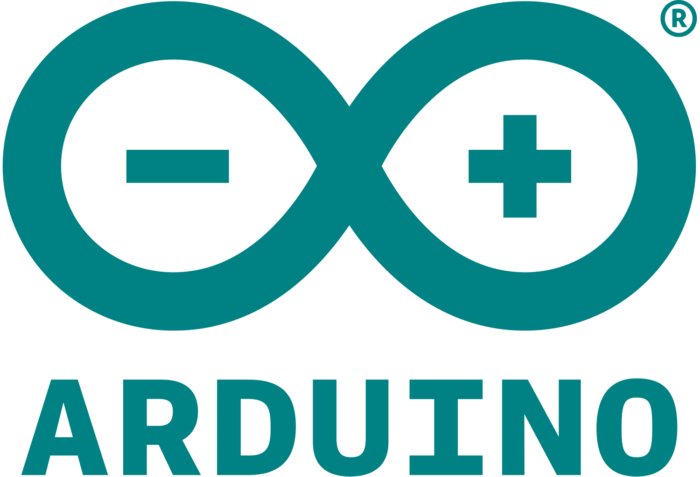

<!-- PROJECT LOGO -->
 

  
  <h3 align="center">⏰탁상 시계⏰</h3>
  

    Open-api를 활용하여 날씨,시계를 실시간 으로 볼수있다.
     

<!-- TABLE OF CONTENTS -->

  
README.md 목차

  <ol>
    <li>
      <a href="#프로젝트-내용">프로젝트 내용</a>
    </li>
    <li><a href="#사용용도">사용용도</a></li>
    <li><a href="#프로젝트-기여">프로젝트 기여</a></li>
    <li><a href="#연락처">연락처</a></li>
    <li><a href="#관련-docs">관련 docs</a></li>
  </ol>

<!-- ABOUT THE PROJECT -->
## 프로젝트 내용
Open-api,아두이노를 활용하여 날씨와 시계를 볼수있는 탁상시계를 만들어보자⏰

<!-- 사용 용도 -->
## 사용용도

‼자신만의 날씨와 시계를 보고싶은 분들‼ 
‼아두이노로 어떤 프로젝트를 해보고 싶은 분들‼

<!-- 프로젝트 기여 -->
## 프로젝트 기여

1. 3D 프린트 의뢰 ✔
2. OPEN-API 이용 ✔
3. C,C++작성 ✔

<!-- 연락처 -->
## 연락처

My Name - [@my_email](https://dldydduq456.com/your_username) - dldydduq456@naver.com
 
소스 필요하시면 연락 주세요

<!-- 관련 docs -->
## 관련 docs
* [C](https://docs.python.org/3/)
* [C++](https://docs.djangoproject.com/ko/3.2/intro/)
* [Arduino](https://www.arduino.cc/)
* [open-Api](https://www.gov.kr/openapi/info)
* [3d 프린트 도면](https://www.thingiverse.com/)

